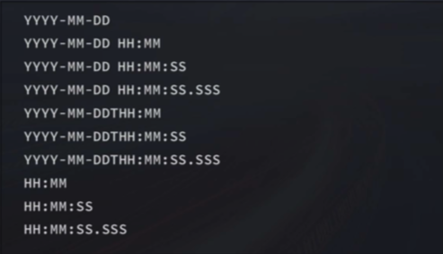

# SQL

- [SQL](#sql)
  - [SQL Language](#sql-language)
    - [SQL \(SQLite\) data types](#sql-sqlite-data-types)
    - [COLUMN Attributes](#column-attributes)
  - [Basic commands](#basic-commands)
    - [SELECT](#select)
    - [Comments](#comments)
    - [Logical Operators](#logical-operators)
    - [Math operators](#math-operators)
    - [Other Commands](#other-commands)
  - [WildCards](#wildcards)
  - [SQL Functions](#sql-functions)
    - [Math](#math)
    - [String Functions\(&lt;str&gt;\)](#string-functionsstr)
    - [Date Time Functions](#date-time-functions)
    - [CAST](#cast)
    - [Aggregators](#aggregators)
  - [Subqueries](#subqueries)
  - [Join](#join)
  - [CASE Statement](#case-statement)
  - [Window Function](#window-function)
  - [View](#view)
  - [Stored Procedures](#stored-procedures)
  - [Strings and Time String Operations](#strings-and-time-string-operations)

---

## SQL Language

- widely used in database management system
  - each DBMS has own **dialect**
- non-procedural lanaguage
- Key Concepts
  - one-t0-many, many-to-many, one-to-one: "has" relationship
  - Primary key
  - Foreign key

4 Core functions

- Data Definition language
- Data Manipulation language
- Data Control language
- Data Query Lanaguage

### SQL \(SQLite\) data types

- Integer
  - ENUM - fixed n types of class
  - INT2, INT8, 
  - INTEGER
  - BIGINT
  - UNSIGNED BIG INT
- Text
  - CLOB
  - CHAR - fixed length array, can store up to this length, NULL to fill digits
  - VARCHAR - variable length array, but maximum needs to be specified
  - NCHAR
- Real 
- Numeric
  - numeric decimal, date time, boolean
  - DATETIME
  - TIMESTAMP
  - DATE
  - TIME
  - BOOLEAN
- Blob
- NULL

### COLUMN Attributes

- PRIMARY KEY
- UNIQUE
- INDEX
- NOT NULL
- FOREIGN KEY


## Basic commands

### SELECT

SELECT \[DISTINCT\] &lt;columns&gt;

- DISTINCT 
  - returns only distinct values
- FROM &lt;table&gt; 
- WHERE &lt;predicate&gt; 
  - &lt;predicate&gt; = &lt;col name&gt;  &lt;operator&gt; &lt;value&gt;
    - &lt;operators&gt;
      - = , &lt;&gt;, &gt;, &lt;, &gt;=\(!&lt;\), &lt;=\(!&gt;\)
      - BETWEEN
      - IS NULL
      - Logical
        - AND &gt;= OR 
        - NOT
        - IN
          - faster than "OR"
      - LIKE &lt;wildcard expression&gt;
- ORDER BY &lt;column&gt;
  - DESC, ASC to specify the order
    - only word on the column immediately precede
  - must be used at the last of the clause
- LIMIT &lt;\# of records&gt;
  - in SQL Sever and Access, use TOP
  - in DB2, FETCH FIRST ... ROWS
  - in Oracal ROWNUM &lt;= ...
- AS
  - variable
  - SELECT &lt;constant&gt; AS

### Comments

- -- for single line, /\*\*/ for block

### Logical Operators

- AND
  - higher precedence
- OR
- IN
- NOT

### Math operators

- +, -, \*, /

### Other Commands

- UPDATE &lt;table&gt; SET &lt;column&gt; = &lt;value&gt; WHERE &lt;predicate&gt;
- SET
- DELETE FROM &lt;table&gt; WHERE &lt;predicate&gt;
- WITH &lt;name&gt; as &lt;clause&gt;
  - simplify nested clauses

## WildCards

- cannot work on non-text data
- takes longer to run than logical operator

wildcards

- -: all
- % - any number of characters
  - Access uses \*
- \_ - matches a single character \(DB2 not supported\)
- \[\] - specify a set of characters \(SQLite not supported\)
- at the end of data usually takes longer to run

## SQL Functions

### Math

- ABS\(\), MOD\(\), ROUND\(\) - arithmetic operations 

### String Functions\(&lt;str&gt;\)

- CONCAT
- LENGTH
- CHAR\_LENGTH
- LOWER
- UPPER
- REPLACE
- SUBSTRING

### Date Time Functions

- CURRENT\_DATE\(\)
- CURRENT\_TIME\(\)
- CURRENT\_TIMESTAMP\(\)
- EXTRACT\(\)
  - EXTRACT\( YEAR FROM '2019-04-03'\)
- DATE\(\)
- YEAR\(\)
- MONTH\(\)
- DAY\(\)
- HOUR\(\)
- MINUTE\(\)
- SECOND\(\)

### CAST

- CAST\(&lt;data&gt; AS &lt;value type&gt;\)
- COALESCE\(\) - the first non-NA value

### Aggregators

- AVG\(\)
- COUNT\(\)
  - COUNT\(\*\) - contains NULL values
  - COUNT\(&lt;col name&gt;\) - no NULL values
- MAX\(\)
  - MIN\(\)
- ROW\__NUMBER\(\)_
- _RANK\(\)_
- _DENSE\_RANK_
- GROUP BY &lt;columes&gt; \[HAVING\] &lt;predicates&gt;

  - WHERE filters pre-grouping data
  - HAVING filters post-grouping data \(group level filter\)

- &lt;Aggregator&gt; OVER \( &lt;PARTITION BY clause&gt; &lt;ORDER BY clause&gt; &lt; ROW or RANGE clause&gt;\)

  - **Window calculation*- created by PARTITION

## Subqueries 

SELECT ...FROM ...WHERE &lt;col&gt; in &lt;subquery&gt; \( SELECT...\) AS...

- subquery can only retrieve a **single column**
  - relevant subjoin: work as nested loop, criterion contains a varaible
  - irrelevant one just return a value
- use indentation
- Key words
  - ANY, SOME
  - ALL
  - EXIST, IN
    - which is faster is depend on index and which table is bigger \(which index is used\)

## Join

SQL has many standards, the mainstream ones are SQL92 and SQL99, 92 is simpler than 99, both widely supported

- Cross\(Cartesian\) Join
  - SELECT from two different tables the column, no matches happened, list all combinations of rows of first table multiplied by rows of second table
  - AS - set aliases, useful when doing joins
    - Oracle does not support AS
- INNER JOIN
- LEFT JOIN, RIGHT JOIN
  - SELECT ... FROM &lt;tableA&gt; LEFT JOIN &lt;tableB&gt; **ON*- ... USING...
    - ON specifies condition
    - USING specifies key \(if same key in both tables\)
  - SQLIte only supports left join
- Self Join
  - join with itself
  - more preferable than subquery
- FULL OUTTER JOIN 
  - join everything \(Union\)
- UNION
  - stack two tables \(concatenate\)
    - each SELECT must have same number of columns and same datatypes of each column
  - UNION DISTINCT is same as UNION, UNION ALL allows duplicates but faster
    - often use UNION ALL + condition
- NATURAL JOIN
- JOINS
  - 

## CASE Statement

- CASE &lt;inpression&gt; WHEN &lt; condition&gt; THEN &lt; result expression&gt; \[ELSE &lt;else result expression&gt;\] END
- CASE &lt;boolean expression&gt; THEN &lt;result expression&gt; \[ELSE &lt;else statement&gt;\] - serve as a search 

## Window Function

&lt;window function&gt; OVER \[PARTITION BY\] &lt;column A&gt; ORDER BY&lt;column B&gt;\[DESC\]

window function can be

- window functions
  - rank
  - dense\_rank
  - row\_number
- aggregators
  - sum, avg, count, max, min...

## View

- A **view*- is a stored query that will be removed with the session end
- CREATE \[TEMP\] VIEW \[IF NOT EXIST\] &lt;view\_name&gt; AS &lt;select statement&gt;
- ALTER VIEW &lt;view\_name&gt; AS ...
- DROP VIEW &lt;view\_name&gt;
- SELECT &lt; ...&gt; FROM &lt;view\_name&gt; \[DROP VIEW &lt;view name&gt;\]
  - decide if the view will be gone after use
- not all DBMS supports building index on views

## Stored Procedures

Stored query works like functions

- CREATE PROCEDURE
  - BEGIN ... END
  - parameters
    - IN
    - OUT
    - INOUT
- DECLARE
- SET
- SELECT ... INTO: assign
- Control flow
  - IF.. THEN...ENDIF
  - CASE
    - WHEN ... THEN
  - REPEAT .. UNTIL END REPEAT
  - LOOP, LEAVE, ITERATE
  - WHILE DO ENDWHILE

```SQL
CREATE PROCEDURE `get_hero_scores`(
       OUT max_max_hp FLOAT,
       OUT min_max_mp FLOAT,
       OUT avg_max_attack FLOAT,  
       s VARCHAR(255)
       )
BEGIN
       SELECT MAX(hp_max), MIN(mp_max), AVG(attack_max) FROM heros WHERE role_main = s INTO max_max_hp, min_max_mp, avg_max_attack;
END

CALL get_hero_scores(@max_max_hp, @min_max_mp, @avg_max_attack, '战士');
SELECT @max_max_hp, @min_max_mp, @avg_max_attack;
```

- upside
  - reuse code
  - secure and efficient \(network communication\)
- downside
  - hard to maintain \(version control\) and move around DBMS
  - hard to debug
  - hard to parallelize 

## Strings and Time String Operations

- Concatenations
  - SELECT \( &lt;a&gt; \|\| &lt;b&gt; ...\)
    - SQL Server use + instead of \|\|

- TRIM
  - RTRIM LTRIM
- SUBSTR\( &lt;s&gt;, &lt;pos&gt;, &lt;num&gt;\)
- UPPER, LOWER, UCASE
  
Dates
- each DBMS uses its own datatype
- date plus timestamp could be tricky
  
SQLite Date Time Functions
- DATE
- TIME
- DATETIME
- JULIANDAY
- STRFTIME\( &lt;format&gt;, &lt;timestring&gt;, modifiers...\)
  - "now" - can be used to extract current time

TimeString Formats



Modifiers

