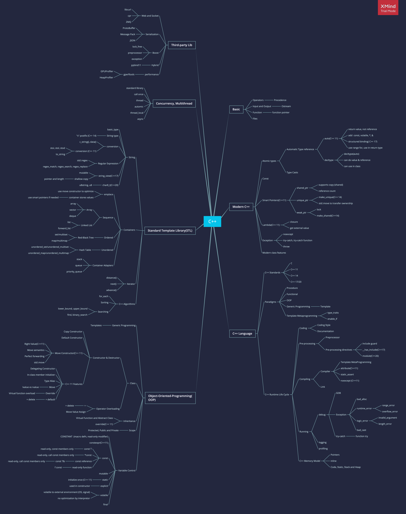

# Summary

- [Basic](basic.md)
- [Data Types](data-types.md)
- [Object Oriented Programming](object-oriented-programming.md)
- [String](string.md)
- [Standard Template Library\(STL\)](standard-template-library.md)
- [Parallel Programming](concurrency-and-multithreading.mdconcurrency-and-multithreading.md)
- [Advanced](advanced.md)

## Reading List

### C
  
- The C Programming Language，[Brian W. Kernighan](https://book.douban.com/search/Brian%20W.%20Kernighan) / [（美）Dennis M. Ritchie](https://book.douban.com/search/Dennis%20M.%20Ritchie)
- C Programming: A Modern Approach
- C Traps and Pitfalls

### C++

- [C++ FAQ](https://www.stroustrup.com/bs_faq.html)
- C++ Premier
- Effective C++
- Effective Modern C++
- More Effective C++

#### Advanced

- Inside the C++ Object Model