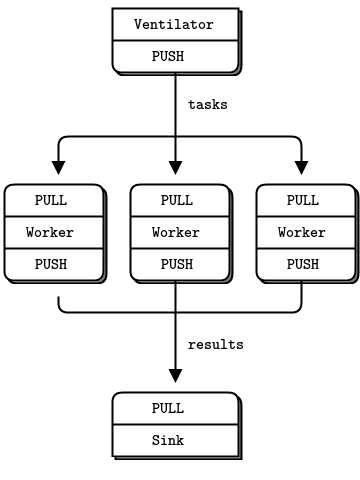

# Other Topics

- [Other Topics](#other-topics)
  - [Serialization](#serialization)
    - [JSON](#json)
    - [Message Pack](#message-pack)
    - [Protobuffer](#protobuffer)
  - [Socket](#socket)
      - [libcurl](#libcurl)
      - [ZMQ](#zmq)
  - [Hybrid System with Scripting Lanaugage](#hybrid-system-with-scripting-lanaugage)
    - [python](#python)
      - [pybind11](#pybind11)
    - [Lua](#lua)
  - [Performance Analysis](#performance-analysis)
    - [Profiling Tools](#profiling-tools)
      - [Linux commands](#linux-commands)
      - [Source Code Debugging Tools](#source-code-debugging-tools)
      - [gperftools](#gperftools)

## Serialization

### JSON

JSON for modern Cpp

```cpp

git clone git@github.com:nlohmann/json.git    # git clone
wget https://github.com/nlohmann/json/releases/download/v3.7.3/json.hpp  # wget 


using json_t = nlohmann::json;


json_t j;                                   // JSON对象

j["age"] = 23;                              // "age":23
j["name"] = "spiderman";                    // "name":"spiderman"
j["gear"]["suits"] = "2099";                // "gear":{"suits":"2099"}
j["jobs"] = {"superhero"};                  // "jobs":["superhero"]  

vector<int> v = {1,2,3};                   // vector容器
j["numbers"] = v;                          // "numbers":[1,2,3]

map<string, int> m =                       // map容器
    {{"one",1}, {"two", 2}};               // 初始化列表 
j["kv"] = m;                               // "kv":{"one":1,"two":2}


cout << j.dump() << endl;         // 序列化，无缩进
cout << j.dump(2) << endl;        // 序列化，有缩进，2个空格


string str = R"({                // JSON文本，原始字符串
    "name": "peter",
    "age" : 23,
    "married" : true
})";

auto j = json_t::parse(str);    // 从字符串反序列化
assert(j["age"] == 23);        // 验证序列化是否正确
assert(j["name"] == "peter");


auto txt = "bad:data"s;        // 不是正确的JSON数据

try                             // try保护代码
{
    auto j = json_t::parse(txt);// 从字符串反序列化
}
catch(std::exception& e)        // 捕获异常
{
    cout << e.what() << endl;
}
```

### Message Pack

[https://msgpack.org/](https://msgpack.org/)

```

vector<int> v = {1,2,3,4,5};              // vector容器

msgpack::sbuffer sbuf;                    // 输出缓冲区
msgpack::pack(sbuf, v);                   // 序列化


cout << sbuf.size() << endl;            // 查看序列化后数据的长度

auto handle = msgpack::unpack(          // 反序列化
            sbuf.data(), sbuf.size());  // 输入二进制数据
auto obj = handle.get();                // 得到反序列化对象

auto handle = msgpack::unpack(          // 反序列化
            sbuf.data(), sbuf.size());  // 输入二进制数据
auto obj = handle.get();                // 得到反序列化对象

msgpack::sbuffer sbuf;                         // 输出缓冲区
msgpack::packer<decltype(sbuf)> packer(sbuf);  // 专门的序列化对象

packer.pack(10).pack("monado"s)                // 连续序列化多个数据
      .pack(vector<int>{1,2,3});

for(decltype(sbuf.size()) offset = 0;          // 初始偏移量是0
    offset != sbuf.size();){                   // 直至反序列化结束

    auto handle = msgpack::unpack(            // 反序列化
            sbuf.data(), sbuf.size(), offset);  // 输入二进制数据和偏移量
    auto obj = handle.get();                  // 得到反序列化对象
}      
```

### Protobuffer

---

## Socket

[https://github.com/zeromq/cppzmq](https://github.com/zeromq/cppzmq)

#### libcurl

cpt\(C++11\)

#### ZMQ

* Message Queue
* Async Dev library



---

## Hybrid System with Scripting Lanaugage

### python

#### [pybind11](https://github.com/pybind/pybind11)

Example

```cpp
#include <pybind11/pybind11.h>        // pybind11的头文件
// cpp file
namespace py = pybind11;               // 名字空间别名，简化代码

PYBIND11_MODULE(pydemo, m)             // 定义Python模块pydemo
{
  m.def("info",                        // 定义Python函数
    []()                              // 定义一个lambda表达式
    {
      py::print("c++ version =", __cplusplus);  // pybind11自己的打印函数
      py::print("gcc version =", __VERSION__);
      py::print("libstdc++   =", __GLIBCXX__);
    }
  );  

  m.def("add",                       // 定义Python函数
    [](int a, int b)                 // 有参数的lambda表达式
    {
      return a + b;
    }
  );  
}                                     // Python模块定义结束

```

```bash

g++ pybind.cpp               \                  #编译的源文件
   -std=c++11 -shared -fPIC   \                 #编译成动态库
  `python3 -m pybind11 --includes` \            #获得包含路径
  -o pydemo`python3-config --extension-suffix`  #生成的动态库名字
```

```cpp

#include <pybind11/stl.h>              // 转换标准容器必须的头文件

PYBIND11_MODULE(pydemo, m)             // 定义Python模块pydemo
{
  m.def("use_str",                     // 定义Python函数
    [](const string& str)              // 入参是string
    {
        py::print(str);
        return str + "!!";            // 返回string
    }
  );  

  m.def("use_tuple",                  // 定义Python函数
    [](tuple<int, int, string> x)     // 入参是tuple
    {
        get<0>(x)++;
        get<1>(x)++;
        get<2>(x)+= "??";
        return x;                     // 返回元组
    }
  );  

  m.def("use_list",                   // 定义Python函数
    [](const vector<int>& v)          // 入参是vector
    {
        auto vv = v;
        py::print("input :", vv);
        vv.push_back(100);
        return vv;                    // 返回列表       
    }
  );
}

```
### Lua

---

## Performance Analysis

### Profiling Tools

#### Linux commands

* top
* pstack, strace
* perf
  
  ```bash
  perf top -K -p xxx
  ```

#### Source Code Debugging Tools

#### [gperftools](https://github.com/gperftools/gperftools/wiki)

Contains CPUProfier and HeapProfiler with powerful functions

```cpp

auto make_cpu_profiler =            // lambda表达式启动性能分析
[](const string& filename)          // 传入性能分析的数据文件名
{
  ProfilerStart(filename.c_str());  // 启动性能分析
  ProfilerRegisterThread();         // 对线程做性能分析

  return std::shared_ptr<void>(     // 返回智能指针
    nullptr,                        // 空指针，只用来占位
    [](void*){                      // 删除函数执行停止动作
        ProfilerStop();             // 停止性能分析
    }   
  );  
};


auto cp = make_cpu_profiler("case1.perf");     // 启动性能分析
auto str = "neir:automata"s;

for(int i = 0; i < 1000; i++) {               // 循环一千次
  auto reg  = make_regex(R"(^(\w+)\:(\w+)$)");// 正则表达式对象
  auto what = make_match();

  assert(regex_match(str, what, reg));        // 正则匹配
}

```

```bash

git clone git@github.com:gperftools/gperftools.git

pprof --text ./a.out case1.perf > case1.txt

Total: 72 samples
  4   5.6%   5.6%   4   5.6% __gnu_cxx::__normal_iterator::base
  4   5.6%  11.1%   4   5.6% _init
  4   5.6%  16.7%   4   5.6% std::vector::begin
  3   4.2%  20.8%   4   5.6% __gnu_cxx::operator-
  3   4.2%  25.0%   5   6.9% std::__distance
  2   2.8%  27.8%   2   2.8% __GI___strnlen
  2   2.8%  30.6%   6   8.3% __GI___strxfrm_l
  2   2.8%  33.3%   3   4.2% __dynamic_cast
  2   2.8%  36.1%   2   2.8% __memset_sse2
  2   2.8%  38.9%   2   2.8% operator new[]
```