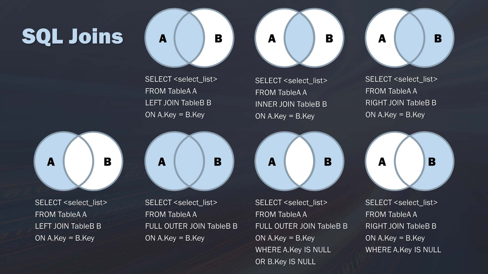
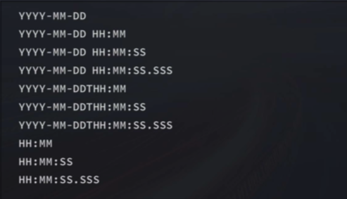

# SQL

- [SQL](#sql)
  - [SQL Language Introduction](#sql-language-introduction)
    - [SQL (SQLite) data types](#sql-sqlite-data-types)
    - [COLUMN Attributes](#column-attributes)
  - [How to Approach Data Query Problems](#how-to-approach-data-query-problems)
  - [Basic commands](#basic-commands)
    - [SELECT](#select)
    - [Comments](#comments)
    - [Logical Operators](#logical-operators)
    - [Math operators](#math-operators)
    - [Other Commands](#other-commands)
  - [WildCards](#wildcards)
  - [SQL Functions](#sql-functions)
    - [Math](#math)
    - [String Functions](#string-functions)
    - [Date Time Functions](#date-time-functions)
    - [CAST](#cast)
    - [Aggregators](#aggregators)
  - [Subqueries](#subqueries)
  - [Join](#join)
  - [CASE Statement](#case-statement)
  - [Window Function](#window-function)
  - [Map and Array Functions (in Hive SQL)](#map-and-array-functions-in-hive-sql)
  - [View](#view)
  - [Stored Procedures](#stored-procedures)
  - [Strings and Time String Operations](#strings-and-time-string-operations)

---

## SQL Language Introduction

- widely used in database management system
  - each DBMS has own **dialect**
  - Types of DBMS include
    - Hierarchical Database (HDB)
    - Relational Database (RDB): managing data using two-dimensional tables composed of rows and columns
      - Oracle Database: Oracle Corporation's RDBMS
      - SQL Server: Microsoft's RDBMS
      - DB2: IBM's RDBMS
      - PostgreSQL: Open-source RDBMS
      - MySQL: Open-source RDBMS
    - Object-Oriented Database (OODB)
    - XML Database (XMLDB)
    - Key-Value Store (KVS), for example, MongoDB
- non-procedural lanaguage
  - [SQL Execution](./sql-execution.md)
- Key Concepts
  - one-to-many, many-to-many, one-to-one: "has" relationship
  - Primary key
  - Foreign key

4 Core functions

- DDL: [Data Definition language](./ddl.md) (CREATE, ALTER, DROP, TRUNCATE, RENAME)
- DML: [Data Manipulation language](./dml-dcl.md) (INSERT, UPDATE, DELETE)
- DCL: [Data Control language](./dml-dcl.md) (COMMIT, ROLLBACK, GRANT, REVOKE)
- Data Query Language (SELECT)

### SQL (SQLite) data types

- Integer
  - ENUM - fixed n types of class
  - INT2, INT8
  - INTEGER
  - BIGINT
  - UNSIGNED BIG INT
- Text
  - CLOB
  - CHAR - fixed length array, can store up to this length, NULL to fill digits
  - VARCHAR - variable length array, but maximum needs to be specified
  - NCHAR
- Real
- Numeric
  - numeric decimal, date time, boolean
  - DATETIME
  - TIMESTAMP
  - DATE
  - TIME
  - BOOLEAN
- Blob
- NULL

### COLUMN Attributes

- PRIMARY KEY
- UNIQUE
- INDEX
- NOT NULL
- FOREIGN KEY

## How to Approach Data Query Problems

1. What the final result looks like
2. Where to pull data
   1. Join
   2. Aggregate
   3. Donditions
3. What calculations are needed
   1. Calculates
   2. Windows
   3. Filter

## Basic commands

### SELECT

SELECT [DISTINCT] \<columns\> FROM\<table\> WHERE\<predicate\> ORDER BY\<column\> LIMIT\<\# of records\> OFFSET\<\# of records\> AS ...

- DISTINCT
  - returns only distinct values
- FROM\<table\>
- WHERE\<predicate\>
  -\<predicate\> =\<col name\> \<operator\>\<value\>
    -\<operators\>
      - = ,\<\>, \>,\<, >=,\<=\(!\>\)
      - BETWEEN
      - IS NULL
      - Logical
        - AND \>= OR
        - NOT
        - IN
          - faster than "OR"
      - LIKE\<wildcard expression\>
- ORDER BY\<column\>
  - DESC, ASC to specify the order
    - only word on the column immediately precede
  - must be used at the last of the clause
- LIMIT\<\# of records\>
  - in SQL Sever and Access, use TOP
  - in DB2, FETCH FIRST ... ROWS
  - in Oracal ROWNUM\<= ...
- OFFSET
  - offsets the first\<\# of records\>
- AS
  - variable
  - SELECT\<constant\> AS

### Comments

- -- for single line, /\*\*/ for block

### Logical Operators

- AND
  - higher precedence
- OR
- IN
- NOT

### Math operators

- +, -, \*, /

### Other Commands

- UPDATE\<table\> SET\<column\> =\<value\> WHERE\<predicate\>
- SET
- DELETE FROM\<table\> WHERE\<predicate\>
- WITH\<name\> as\<clause\>
  - simplify nested clauses

## WildCards

- cannot work on non-text data
- takes longer to run than logical operator

wildcards

- -: all
- % - any number of characters
  - Access uses \*
- \_ - matches a single character (DB2 not supported)
- \[\] - specify a set of characters (SQLite not supported)
- at the end of data usually takes longer to run

## SQL Functions

### Math

- ABS\(\), MOD\(\), ROUND\(\) - arithmetic operations 

### String Functions

| Return Type | Function | Description |
|-------------|----------|-------------|
| int         | length(string A) | Returns the length of the string |
| string      | reverse(string A) | Reverses the string |
| string      | concat(string A, string B...) | Concatenates strings, e.g., concat('foo', 'bar') = 'foobar' |
| string      | substr(string A, int start) substring(string A, int start) | Returns a substring, e.g., substr('foobar', 4) = 'bar' |
| string      | substr(string A, int start, int len) | Returns a substring of limited length, e.g., substr('foobar', 4, 1) = 'b' |
| string      | upper(string A) ucase(string A) | Converts to uppercase |
| string      | lower(string A) lcase(string A) | Converts to lowercase |
| string      | trim(string A) | Trims spaces from both sides of the string |
| string      | ltrim(string A) | Trims spaces from the left side of the string |
| string      | rtrim(string A) | Trims spaces from the right side of the string |
| string      | regexp_extract(string subject, string pattern, int index) | Returns a substring extracted using a regular expression |
| string      | space(int n) | Returns a string containing n spaces |
| string      | repeat(string str, int n) | Repeats the string str n times |
| string      | ascii(string str) | Returns the ASCII code of the first character of the string |
| string      | lpad(string str, int len, string pad) | Pads the string str on the left to length len with the string pad |
| string      | rpad(string str, int len, string pad) | Pads the string str on the right to length len with the string pad |
| array       | split(string str, string pat) | Splits the string str using the pattern pat as a regular expression, e.g., split('foobar', 'o')[2] = 'bar' |
| string      | replace(string A, string search, string replace) | Replaces all occurrences of search in string A with replace |

### Date Time Functions

- CURRENT\_DATE\(\)
- CURRENT\_TIME\(\)
- CURRENT\_TIMESTAMP\(\)
- EXTRACT\(\)
  - EXTRACT( YEAR FROM '2019-04-03')
- DATE\(\)
- YEAR\(\)
- MONTH\(\)
- DAY\(\)
- HOUR\(\)
- MINUTE\(\)
- SECOND\(\)

### CAST

- CAST\<data\> AS\<value type\>
- COALESCE\(\) - the first non-NA value

### Aggregators

- AVG()
- COUNT()
  - COUNT(*) - includes NULL values
  - COUNT(<col name>) - excludes NULL values
- MAX()
- MIN()
- ROW_NUMBER()
- RANK()
- DENSE_RANK()
- GROUP BY <columns> [HAVING <predicates>]
  - WHERE filters pre-grouping data
  - HAVING filters post-grouping data (group level filter)
- <Aggregator> OVER (<PARTITION BY clause> <ORDER BY clause> <ROW or RANGE clause>)
  - use as **Window Funciton** - created by PARTITION

## Subqueries

SELECT ...FROM ...WHERE\<col\> in\<subquery\>

- subquery can only retrieve a **single column**
  - relevant subjoin: work as nested loop, criterion contains a varaible
  - irrelevant one just return a value
- use indentation
- Key words
  - ANY, SOME
  - ALL
  - EXIST, IN
    - which is faster is depend on index and which table is bigger \(which index is used\)

## Join

SQL has many standards, the mainstream ones are SQL92 and SQL99, 92 is simpler than 99, both widely supported

- Cross\(Cartesian\) Join
  - SELECT from two different tables the column, no matches happened, list all combinations of rows of first table multiplied by rows of second table
  - AS - set aliases, useful when doing joins
    - Oracle does not support AS
- INNER JOIN
- LEFT JOIN, RIGHT JOIN
  - SELECT ... FROM\<tableA\> LEFT JOIN\<tableB\> **ON*- ... USING...
    - ON specifies condition
    - USING specifies key \(if same key in both tables\)
  - SQLIte only supports left join
- Self Join
  - join with itself
  - more preferable than subquery
- FULL OUTTER JOIN
  - join everything \(Union\)
- UNION
  - stack two tables \(concatenate\)
    - each SELECT must have same number of columns and same datatypes of each column
  - UNION DISTINCT is same as UNION, UNION ALL allows duplicates but faster
    - often use UNION ALL + condition
- NATURAL JOIN
- JOINS
  - 

## CASE Statement

- CASE \<inpression\> WHEN \<condition\> THEN \<result expression\> ELSE \<else result expression\> END

## Window Function

\<window function\> OVER [PARTITION BY] \<column A\> ORDER BY \<column B\> [DESC]

[window functions](https://mode.com/sql-tutorial/sql-window-functions/) are used to perform calculations on a subset of a table

- parameters
  - 'PARTITION BY' clause is an optional parameter that indicates how to divide the query rows into groups, similar to the grouping function of the 'GROUP BY' clause.
  - 'ORDER BY' clause is an optional parameter that indicates how to sort the rows in each partition, determining the rules (fields) by which the window is sorted within.
- 4 types
  - rank
  - [dense\_rank](https://mode.com/sql-tutorial/sql-window-functions/#rank-and-dense_rank)
  - [row\_number](https://mode.com/sql-tutorial/sql-window-functions/#row-number)
  - aggregators
- aggregators
  - sum, avg, count, max, min...

## Map and Array Functions (in Hive SQL)

| Return Type | Function | Description |
|-------------|----------|-------------|
| boolean     | array_contains(array, value) | Checks if an array contains a specific value |
| int         | size(array) | Returns the size of the array |
| array       | sort_array(array) | Sorts the array in ascending order |
| array       | array(...) | Creates an array with the specified elements |
| array       | concat(array1, array2) | Concatenates two arrays |
| array       | explode(array) | Explodes an array into multiple rows |
| map         | map(key1, value1, key2, value2, ...) | Creates a map with the specified keys and values |
| array       | map_keys(map) | Returns an array of the keys in the map |
| array       | map_values(map) | Returns an array of the values in the map |
| int         | size(map) | Returns the size of the map |
| string      | get(map, key) | Returns the value associated with the specified key |
| map         | explode(map) | Explodes a map into multiple rows with key-value pairs |


Introduction to `LATERAL VIEW EXPLODE` in Hive SQL

- **Purpose**: The `LATERAL VIEW EXPLODE` function in Hive SQL is used to explode an array or a map into multiple rows. This is particularly useful when you have a complex data type (like an array or map) and you want to flatten it into individual rows for easier querying and analysis.
- **Syntax**:
  ```sql
  SELECT columns
  FROM table_name
  LATERAL VIEW explode(array_column) exploded_table AS exploded_column;
  ```
- **Explanation**:
  - `array_column`: The column containing the array or map you want to explode.
  - `exploded_table`: An alias for the table generated by the `explode` function.
  - `exploded_column`: An alias for the resulting columns from the `explode` function.
- **Example**:

  Suppose you have a table `orders` with the following data:
  ```sql
  CREATE TABLE orders (
    order_id INT,
    product_ids ARRAY<INT>
  );

  INSERT INTO orders VALUES (1, ARRAY(101, 102, 103));
  INSERT INTO orders VALUES (2, ARRAY(104, 105));
  ```

  To explode the `product_ids` array into individual rows, you would use the `LATERAL VIEW EXPLODE` function as follows:
  ```sql
  SELECT order_id, product_id
  FROM orders
  LATERAL VIEW explode(product_ids) exploded_table AS product_id;
  ```

  - **Result**:
    ```
    +----------+------------+
    | order_id | product_id |
    +----------+------------+
    |        1 |        101 |
    |        1 |        102 |
    |        1 |        103 |
    |        2 |        104 |
    |        2 |        105 |
    +----------+------------+
    ```
- **Use Cases**:
  - **Flattening Arrays**: When you need to convert an array column into multiple rows.
  - **Processing JSON Data**: Useful for processing JSON arrays and maps stored in Hive tables.
  - **Data Transformation**: Simplifies data transformation tasks by breaking down complex data types into simpler rows.
- **Additional Notes**:
  - The `LATERAL VIEW` keyword is used to apply the `explode` function to each row of the table.
  - You can use multiple `LATERAL VIEW` clauses to explode multiple columns in a single query.

By using the `LATERAL VIEW EXPLODE` function, you can easily handle and analyze complex data types in Hive SQL, making your data processing tasks more straightforward and efficient.

## View

- A **view*- is a stored query that will be removed with the session end
- CREATE \[TEMP\] VIEW [IF NOT EXIST] \<view\_name\> AS \<select statement\>
- ALTER VIEW\<view\_name\> AS ...
- DROP VIEW\<view\_name\>
- SELECT\< ...\> FROM \<view\_name\> [DROP VIEW] \<view name\>
  - decide if the view will be gone after use
- not all DBMS supports building index on views

## Stored Procedures

Stored query works like functions

- CREATE PROCEDURE
  - BEGIN ... END
  - parameters
    - IN
    - OUT
    - INOUT
- DECLARE
- SET
- SELECT ... INTO: assign
- Control flow
  - IF.. THEN...ENDIF
  - CASE
    - WHEN ... THEN
  - REPEAT .. UNTIL END REPEAT
  - LOOP, LEAVE, ITERATE
  - WHILE DO ENDWHILE

```SQL
CREATE PROCEDURE `get_hero_scores`(
       OUT max_max_hp FLOAT,
       OUT min_max_mp FLOAT,
       OUT avg_max_attack FLOAT,  
       s VARCHAR(255)
       )
BEGIN
       SELECT MAX(hp_max), MIN(mp_max), AVG(attack_max) FROM heros WHERE role_main = s INTO max_max_hp, min_max_mp, avg_max_attack;
END

CALL get_hero_scores(@max_max_hp, @min_max_mp, @avg_max_attack, '战士');
SELECT @max_max_hp, @min_max_mp, @avg_max_attack;
```

- upside
  - reuse code
  - secure and efficient \(network communication\)
- downside
  - hard to maintain \(version control\) and move around DBMS
  - hard to debug
  - hard to parallelize

## Strings and Time String Operations

- Concatenations
  - SELECT  \<a\> \|\| \<b\> ...
    - SQL Server use + instead of \|\|
- TRIM
  - RTRIM LTRIM
- SUBSTR\(\<s\>,\<pos\>,\<num\>\)
- UPPER, LOWER, UCASE
  
Dates

- each DBMS uses its own datatype
- date plus timestamp could be tricky
  
SQLite Date Time Functions

- DATE
- TIME
- DATETIME
- JULIANDAY
- STRFTIME (\<format\>, \<timestring\>, modifiers...)
  - "now" - can be used to extract current time

TimeString Formats



Modifiers

